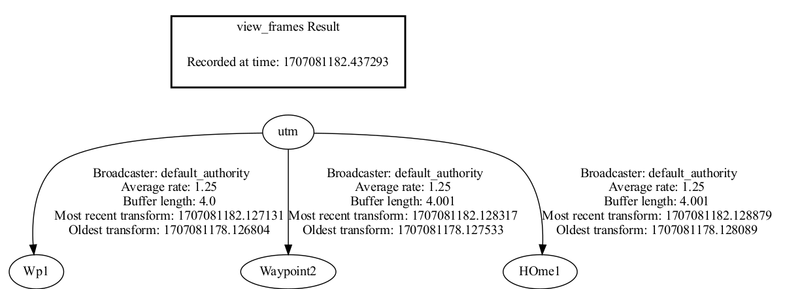

Video demo: https://youtu.be/_fKc2nrKJko


# Waypoint Server

The waypoint server manage different types of waypoints.

The types of waypoints are:
- **Custom**: Waypoint that rover needs to navigate to. Specified by the operator.
- **Autonomous**: Waypoint that rover needs to navigate to during the autonomous challenge.
- **Extreme Delivery**: Waypoint that rover needs to navigate to during the extreme delivery challenge.
- **Home**: Waypoint that the rover can go back to at anytime. For instance, this could be the base station position.
- **Miscellaneous**: Waypoint that the rover does not need to navigate to. Represents a feature in the landscape which is of interest to operators, but not a part of the challenge.


Waypoint server manages waypoints through three types of waypoints list:
- **Mission waypoints** is an ordered list of waypoints that the rover needs to reach
    as part of the mission / challenge.

    Waypoint server manages an index that tracks the progress of mission(`current_mission_waypoint_index`), which could be advanced, reverted, or set to other index through services.

    Contains Extreme Delivery, Autonomous, and Custom type waypoints.

- **Home waypoints** is an unordered list of home type waypoints.

- **Miscellaneous waypoints** is an unordered list of miscellaneous type waypoints.

The waypoint server assumes the rover has 3 modes of operation: mission, home, or not ready (doing nothing).

- The rover is not ready when there is no current waypoint.
- The rover begins / continue mission through the service **Begin Mission**. This means its current waypoint will be set to a mission waypoint (i.e., Custom, Autonomous, or Ext Delivery).
- The rover can go home at anytime during mission / challenge through the service **Begin Home**.  This means its current waypoint will be set to a home waypoint. The rover can continue mission (the same mission waypoint it was tracking before going home) through the service **Begin Mission**.

The persistence feature can be enabled through the ROS parameter `persist_path`.  It loads waypoints from a local database, and updates it after every service call that modifies waypoints (create, edit, remove, move, clear). It creates one if the database doesn't exist.

If the usage is not clear, check `test_waypoint_server.py`, it has a client code for requesting any services.

### Running Waypoint Server
Pass a path for the .db file (even if it doesn't exist) to `persist_path` to enable persistence feature. \
For example `persist_path:=/home/richard/Desktop/waypoints.db`
```bash
ros2 run waypoint_server server
ros2 run waypoint_server server --ros-args -p persist_path:=<path>
```

### Required Dependencies
Geodesy (for UTM)
```bash
sudo apt install ros-<distribution>-geodesy
```


# Services
There are three categories of services:

Services that move the mission waypoint index. These do not modify the waypoints stored in server. The current waypoint is changed accordingly. Only works if current waypoint is a mission waypoint.

- **Advance waypoint** (`/waypoints/mission/advance`, type=`std_srvs/Trigger`)

    Advances our current waypoint to the next mission waypoint.

- **Revert waypoint** (`/waypoints/mission/revert`, type=`std_srvs/Trigger`)

    Reverts our current waypoint to the previous mission waypoint.

- **Set waypoint** (`/waypoints/mission/set`, type=`OperateWaypoint`)

    Sets our current waypoint to a requested mission waypoint (through name).

Services that modify the waypoints stored in server.
The current waypoint may be changed implicitly as a result of some operations.

- **Create waypoint** (`/waypoints/create`, type=`CreateWaypoint`)

    Create a new waypoint (home, mission, or misc) based on request.


- **Edit waypoint** (`/waypoints/edit`, type=`EditWaypoint`)

    Search for an existing waypoint with name `request.current_name` in the list of the
    associated type and edit it to be `request.waypoint`.
    Notes:
    - Editing type only works if the type is originally CUSTOM, AUTONOMOUS, OR EXTREME_DELIVERY,
    and it's edited to either of these.
    - Current waypoint can be edited.

- **Move mission waypoint** (`/waypoints/mission/move`, type=`MoveWaypoint`)

    Moves the position of the requested mission waypoint in the list, in a similar fashion to bringing forward or moving backward.

    Example: Consider mission waypoints named by numbers: [1,2,3,4,5]

    ```python
    # Moves waypoint 3 to the first position (result = [3,1,2,4,5])
    client.send_move_req(0, "Waypoint3")
    # Moves waypoint 2 to the 4th position (result = [3,1,4,2,5])
    client.send_move_req(3, "Waypoint2")
    # Moves waypoint 3 to the final (5th) position (result = [1,4,2,5,3])
    client.send_move_req(4, "Waypoint3")
    ```

    Note that the current waypoint may change: \
    It doesn't change the `current_mission_waypoint_index`, but if this index ends up pointing to a different waypoint as a result, the current waypoint will change.

- **Remove waypoint** (`/waypoints/remove`, type=`OperateWaypoint`)

    Removes an existing waypoint (any type) based on request.
    Removing the current waypoint will stop the mission (need to invoke `Begin Mission` service again).

- **Clear mission waypoints** (`/waypoints/mission/clear`, type=`std_srvs/Trigger`)

    Clears mission waypoint list.
    The current waypoint is also cleared if it's a mission waypoint.

- **Clear home waypoints** (`/waypoints/home/clear`, type=`std_srvs/Trigger`)

    Clears home waypoint list.
    The current waypoint is also cleared if it's a home waypoint.

- **Clear misc waypoints** (`/waypoints/misc/clear`, type=`std_srvs/Trigger`)

    Clears misc waypoint list.

- **Clear all waypoints** (`/waypoints/clear`, type=`std_srvs/Trigger`)
    Clears all waypoint lists. The current waypoint is cleared.

Services that changes operation mode of rover:
The rover may be going home, progressing mission, or doing nothing.
The current waypoint is changed accordingly.

- **Begin mission** (`/waypoints/mission/begin`, type=`std_srvs/Trigger`)

    Begins or continues mission. It sets the current waypoint to the current mission waypoint (if valid) otherwise it's set to the initial mission waypoint.

    The current mission waypoint is the mission waypoint tracked by
    `current_mission_waypoint_index`. It may become invalid if the mission waypoint list is edited such that this index exceeds the size of list.

- **Go home** (`/waypoints/home/begin`, type=`OperateWaypoint`)

    Sets the current waypoint to the requested home waypoint.
    The operator may continue mission by requesting the **Begin Mission** service.


# Publishers

Everything is being published periodically with 1 second period.

- **Ready publisher** (`/waypoints/ready`, type=`std_msgs/Bool`)

    It publishes True if there is a current waypoint (i.e., current publisher is publishing). Otherwise False.

- **Current publisher** (`/waypoints/current`, type=`Waypoint`)

    Publishes the current waypoint.

- **Home waypoints publisher** (`/waypoints/home/all`, type=`WaypointArray`)

    Publishes all home waypoints.

- **Mission waypoints publisher** (`/waypoints/mission/all`, type=`WaypointArray`)

    Publishes all mission waypoints.

- **Miscellaneous waypoints publisher** (`/waypoints/misc/all`, type=`WaypointArray`)

    Publishes all misc waypoints.


### TF broadcaster

Waypoint server broadcasts transforms from `utm` frame to `<waypoint-name>` frame,  for all mission and home waypoints (not miscellaneous).

Example:



These transform will allow the rover go from current state (its frame relative to map is known: `map` -> `odom` -> `base_link`) to any waypoint (its frame relative to utm is known: `utm` -> `<waypoint-name>`).

The transform `utm`-> `map` is given by the navsat_transform node in our navigation package.

# Testing

The `test_waypoint_server.py` imports the server and a client, spins both to test the waypoint server.

To run the entire test suite (around 1 min)
```bash
colcon test --packages-select waypoint_server --event-handlers console_direct+
```
See `build/waypoint_server_/pytest.xml` for more details if error pops up. \
The server should be constantly publishing log messages on the console.

To test specific function
```bash
colcon test --packages-select waypoint_server --event-handlers console_direct+ --pytest-args -k name_of_the_test_function
```

To manual test
Use `rqt` and `sqlitebrowser` 
